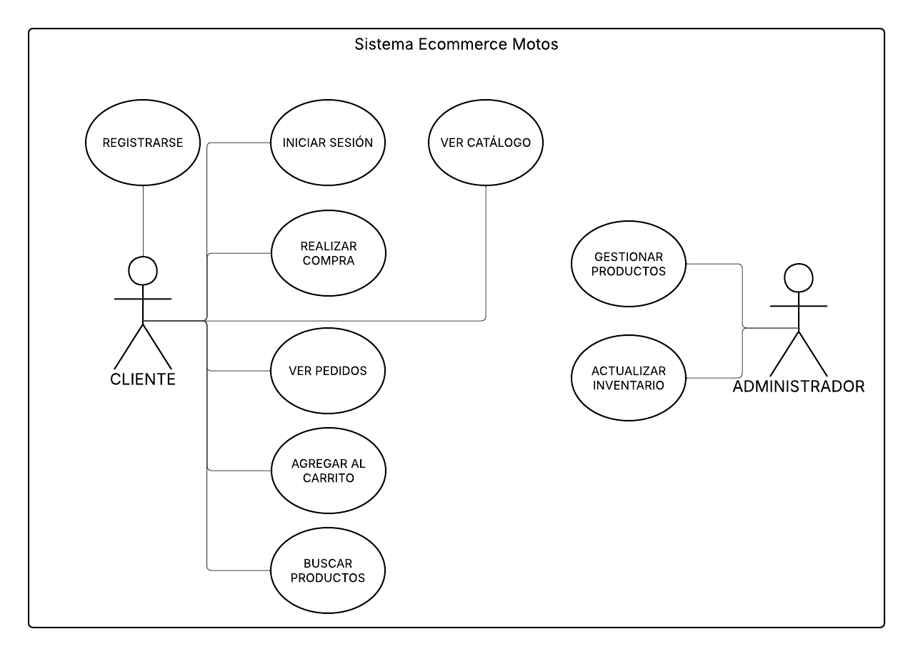

# Casos de Uso — Sprint 1

## Sistema
Tienda en línea de equipamiento y accesorios para motociclistas.

---

# Actores del sistema

## Cliente
Usuario que navega, compra productos y consulta pedidos.

## Administrador
Usuario encargado de gestionar productos, pedidos e inventario.

---

# Casos de uso iniciales

1. Registrarse
2. Iniciar sesión
3. Visualizar catálogo
4. Buscar productos
5. Agregar productos al carrito
6. Realizar compra
7. Ver pedidos
8. Gestionar productos
9. Actualizar inventario
10. Cambiar estado de pedidos

---

# Diagrama de Casos de Uso

