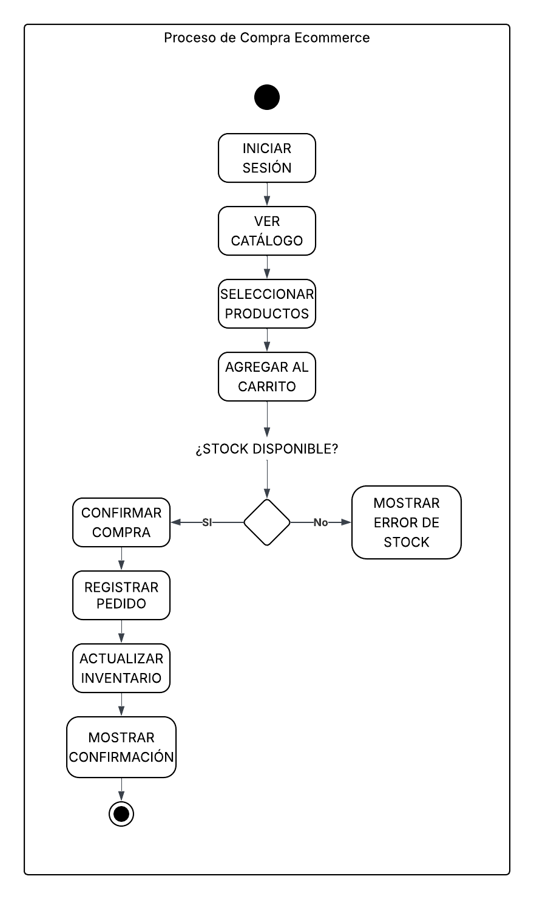

# Diagrama de Actividades — Sprint 2

## Flujo: Proceso de compra

### Actividades principales

1. Cliente inicia sesión.
2. Cliente visualiza catálogo.
3. Cliente selecciona productos.
4. Cliente agrega productos al carrito.
5. Sistema valida stock.
6. Cliente confirma compra.
7. Sistema registra pedido.
8. Sistema actualiza inventario.
9. Sistema muestra confirmación.
10. Fin del proceso.

---

# Diagrama de Actividades

