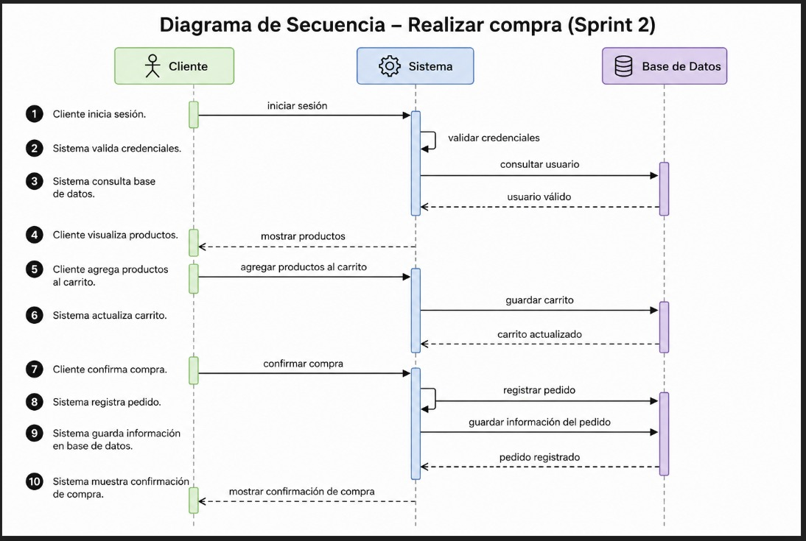

# Diagrama de Secuencia — Sprint 2

## Flujo: Realizar compra

### Participantes

- Cliente
- Sistema
- Base de Datos

---

# Secuencia del proceso

1. Cliente inicia sesión.
2. Sistema valida credenciales.
3. Sistema consulta base de datos.
4. Cliente visualiza productos.
5. Cliente agrega productos al carrito.
6. Sistema actualiza carrito.
7. Cliente confirma compra.
8. Sistema registra pedido.
9. Sistema guarda información en base de datos.
10. Sistema muestra confirmación de compra.

---

# Diagrama de Secuencia

